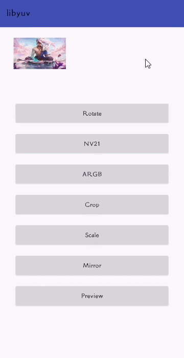

# LibYuv

[](https://repo1.maven.org/maven2/com/github/jenly1314/libyuv)
[](https://jitpack.io/#jenly1314/libyuv)
[](https://github.com/jenly1314/libyuv/actions/workflows/build.yml)
[](https://raw.githubusercontent.com/jenly1314/libyuv/master/app/release/app-release.apk)
[](https://developer.android.com/guide/topics/manifest/uses-sdk-element#ApiLevels)
[](https://opensource.org/licenses/mit)


LibYuv：基于Google的libyuv编译封装的YUV转换工具库，主要用途是在各种YUV与RGB之间进行相互转换、裁减、旋转、缩放、镜像等。

## 效果展示


> 你也可以直接下载 [演示App](https://raw.githubusercontent.com/jenly1314/libyuv/master/app/release/app-release.apk) 体验效果

## 引入

### Gradle:

1. 在Project的 **build.gradle** 或 **setting.gradle** 中添加远程仓库

    ```gradle
    repositories {
        //...
        mavenCentral()
    }
    ```

2. 在Module的 **build.gradle** 中添加依赖项
    ```gradle
    // AndroidX
    implementation 'com.github.jenly1314:libyuv:1.0.0'
    ```

## 使用

### 使用概要

LibYuv中的功能方法主要包括：格式转换、裁减、旋转、缩放、镜像等；下面就以文档注释的形式对一些主要的方法做个简要说明。

#### 格式转换
```java
/**
 * 将Image转换为I420
 *
 * @param image   图像；{@link Image}
 * @param degrees 需要旋转的角度
 * @return 返回I420数据
 */
LibYuv.imageToI420(image, degrees)
```

```java
/**
 * NV21转I420
 *
 * @param nv21Data 源NV21数据
 * @param width    图像宽度
 * @param height   图像高度
 * @return 返回I420数据
 */
LibYuv.nv21ToI420(nv21Data, width, height)
```

```java
/**
 * I420转NV21
 *
 * @param i420Data 源I420数据
 * @param width    图像宽度
 * @param height   图像高度
 * @return 返回NV21数据
 */
LibYuv.i420ToNv21(i420Data, width, height)
```

##### 通用格式转换（各种YUV与RGB之间相互转换）

```java
/**
 * 将I420数据转换为指定格式的数据
 *
 * @param i420Data 源I420数据
 * @param width    图像宽度
 * @param height   图像高度
 * @param fourcc   指定数据格式；{@link FourCC}
 * @return 返回转换成指定格式后的数据
 */
LibYuv.convertFromI420(i420Data, width, height, fourcc)
```

```java
/**
 * 将指定格式的数据转换为I420数据
 *
 * @param srcData 源数据
 * @param width   图像宽度
 * @param height  图像高度
 * @param fourcc  指定数据格式；{@link FourCC}
 * @return 返回I420数据
 */
LibYuv.convertToI420(srcData, width, height, fourcc)
```

#### 旋转
```java
/**
 * 将指定格式的数据进行旋转
 *
 * @param srcData 源数据
 * @param width   图像宽度
 * @param height  图像高度
 * @param degrees 需要旋转的角度；{@link  RotationMode}
 * @param fourcc  指定数据格式；{@link FourCC}
 * @return 返回旋转后的数据
 */
LibYuv.rotate(srcData, width, height, degrees, fourcc)
```

#### 缩放
```java
/**
 * 将指定格式的数据进行缩放
 *
 * @param srcData    源数据
 * @param width      图像宽度
 * @param height     图像高度
 * @param dstWidth   目标宽
 * @param dstHeight  目标高
 * @param fourcc     指定数据格式；{@link FourCC}
 * @param filterMode 压缩过滤模式；{@link  FilterMode}
 * @return 返回缩放后的数据
 */
LibYuv.scale(srcData, width, height, dstWidth, dstHeight, fourcc, filterMode)
```

#### 裁减
```java
/**
 * 将指定格式的数据进行裁减
 *
 * @param srcData  源数据
 * @param width    图像宽度
 * @param height   图像高度
 * @param cropRect 裁减的矩形区域
 * @param fourcc   指定数据格式；{@link FourCC}
 * @return 返回裁减后的数据
 */
LibYuv.crop(srcData, width, height, cropRect, fourcc)
```

#### 镜像
```java
/**
 * 将指定格式的数据进行镜像翻转
 *
 * @param srcData 源数据
 * @param width   图像宽度
 * @param height  图像高度
 * @param fourcc  指定数据格式；{@link FourCC}
 * @return 返回镜像翻转后的数据
 */
LibYuv.mirror(srcData, width, height, fourcc)
```

更多使用详情，请查看[app](app)中的源码使用示例或直接查看 [API帮助文档](https://jenly1314.github.io/libyuv/api/)

**温馨提示**

* 关于 **FourCC** 说明；在 **[FourCC](libyuv/src/main/java/com/king/libyuv/FourCC.java)** 中定义了很多数据格式类型（各种YUV与RGB格式；例如：I420、I422、NV21、NV12、ARGB、BGRA等）；
> 在使用各转换方法时，明确转换前和转换后的数据格式类型，这一点很重要。

* 还有个小细节需要注意，如果在转换过程中出现转换结果图像的颜色与源图像颜色不一致时，很大可能是数据格式的问题；也就是数据的排列顺序不对，这时只需修改下入参的数据格式就行。
> 比如：当使用 **RGBA** 数据进行转换操作时，在使用LibYuv时数据的排列顺序是反的，这时需使用 **ABGR** 来表示这个排列（即：指定数据格式为：`FourCC.FOURCC_ABGR`）

## 相关推荐

- [CameraScan](https://github.com/jenly1314/CameraScan) 一个简化扫描识别流程的通用基础库。
- [MLKit](https://github.com/jenly1314/MLKit) 一个强大易用的工具包。通过ML Kit您可以很轻松的实现文字识别、条码识别、图像标记、人脸检测、对象检测等功能。
- [WeChatQRCode](https://github.com/jenly1314/WeChatQRCode) 基于OpenCV开源的微信二维码引擎移植的扫码识别库。
- [ZXingLite](https://github.com/jenly1314/ZXingLite) 基于zxing实现的扫码库，优化扫码和生成二维码/条形码功能。
- [ViewfinderView](https://github.com/jenly1314/ViewfinderView) ViewfinderView一个取景视图：主要用于渲染扫描相关的动画效果。

<!-- end -->

## 版本日志

#### v1.0.0：2023-4-30
* libyuv初始版本

---


